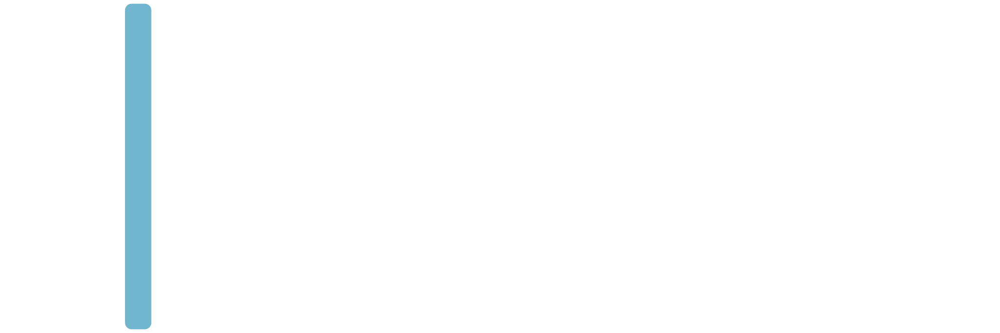
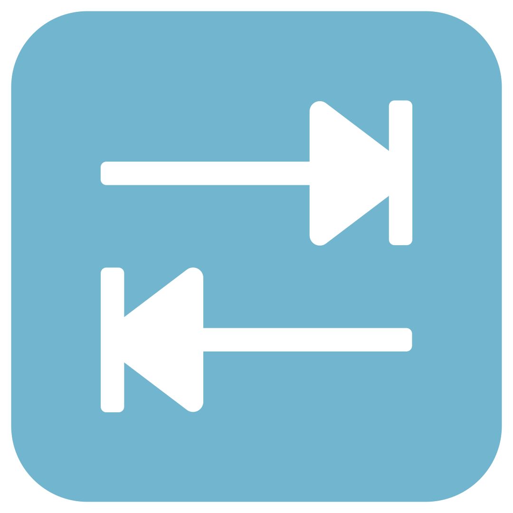

# About Chas Bartab

## Routing

## Controllers

## Models

## Views

## Contributors

- [Simon Nordström]("https://github.com/SimonNord")
- [Andréas Ny]("https://github.com/andreasnyh")
- [Hung Ta]("https://github.com/ByHT")
- [Erik Axelsson]("https://github.com/erax83")
- [Dylan Nore]("https://github.com/DylanNore")
- [Karl Falk]("https://github.com/Voldakka")
- [Project on Github]("https://github.com/andreasnyh/ChasStudentDebt")
&copy; 2020 Chas Academy

## License of Laravel Framework

The Laravel framework is open-sourced software licensed under the [MIT license](https://opensource.org/licenses/MIT).

